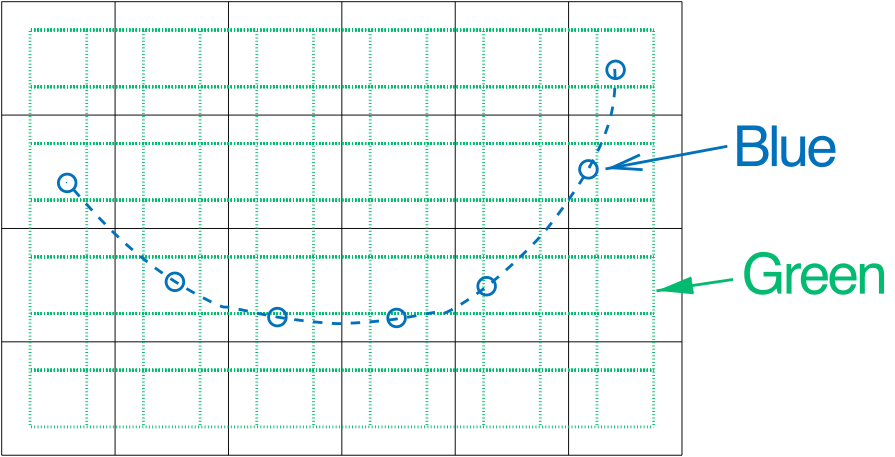

Interpolation in ARTS
#####################

Linear interpolation
====================

There are no general single-step interpolation functions in ARTS.
Instead, there is a set of useful utility functions that can be used
to achieve interpolation. Roughly, you can separate these into
functions determining grid position arrays, functions determining
interpolation weight tensors, and functions applying the
interpolation. Doing an interpolation thus requires a chain of
function calls:

1. ``gridpos`` (one for each interpolation dimension)
2. ``interpweights``
3. ``interp``

Currently implemented in ARTS is multilinear interpolation in up to 6
dimensions. (Is the 6D case called hexa-linear interpolation?)  The
necessary functions and their interaction will be explained in this
chapter.

Implementation files
--------------------

Variables and functions related to interpolation are defined in the files:

- ``interpolation.h``
- ``interpolation.cc``
- ``test interpolation.cc``

The first two files contain the declarations and implementation, the last file some usage
examples.

Green and blue interpolation
----------------------------

  The two different types of interpolation. Green (dotted):
  Interpolation to a new grid, output has same dimension as input,
  in this case 2D. Blue (dashed): Interpolation to a sequence of
  points, output is always 1D.

There are two different types of interpolation in ARTS:

- *Green Interpolation*: Interpolation of a gridded field to a new grid.
- *Blue Interpolation*: Interpolation of a gridded field to a sequence of positions.

The figure above illustrates the different types
for a 2D example. 

The first step of an interpolation always consists in determining
where your new points are, relative to the original grid. You can do
this separately for each dimension. The positions have to be stored
somehow, which is described in the next section.

Grid checking functions
-----------------------

Before you do an interpolation, you should check that the new grid is
inside the old grid. (Or only slightly outside.) You can use the
convenience function ``chk_interpolation_grids`` for this
purpose, which resides in file ``check_input.cc``. The
function has the following parameters:

.. code-block:: C++

  const String&     which_interpolation   A string describing the 
                                          interpolation for which 
                                          the grids are intended. 
  ConstVectorView   old_grid              The original grid.
  ConstVectorView   new_grid              The new grid.
  const Numeric&    extpolfac             The extrapolation fraction. 
                                          See gridpos function for 
                                          details. Has a default 
                                          value, which is consistent 
                                          with gridpos.  

There is also a special version for the case that the new grid is just
a scalar. What the function does is check if old and new grid for an
interpolation are ok. If not, it throws a detailed runtime error
message. 

The parameter ``extpolfac`` determines how much extrapolation
is tolerated. Its default value is 0.5, which means that we allow
extrapolation as far out as half the spacing of the last two grid
points on that edge of the grid.

The ``chk_interpolation_grids`` function is quite thorough.
It checks not only the grid range, but also the proper sorting,
whether there are duplicate values, etc.. It is not completely cheap
computationally. Its intended use is at the beginning of workspace
methods, when you check the input variables and issue runtime errors
if there are any problems. The runtime error thrown also explains in
quite a lot of detail what is actually wrong with the grids.
  

Grid positions
--------------

A grid position specifies where an interpolation point is, relative
to the original grid. It consists of three parts, an :class:`pyarts.arts.Index` giving the
original grid index below the interpolation point, a :class:`pyarts.arts.Numeric`
giving the fractional distance to the next original grid point, and a
:class:`pyarts.arts.Numeric` giving 1 minus this number. Of course, the last element is
redundant. However, it is efficient to store this, since it is used
many times over. We store the two numerics in a plain C array of
dimension 2. (No need to use a fancy Array or Vector for this, since
the dimension is fixed.) So the structure ``GridPos`` looks like:

.. code-block:: C++

  struct GridPos  {
    Index   idx;      /*!< Original grid index below
                            interpolation point. */
    Numeric fd[2];    /*!< Fractional distance to next point
                            (0<=fd[0]<=1), fd[1] = 1-fd[0]. */ 
  };

For example, ``idx``=3 and ``fd``=0.5 means that this interpolation point is
half-way between index 3 and 4 of the original grid.  Note, that
"below" in the first paragraph means "with a lower index". If the
original grid is sorted in descending order, the value at the grid
point below the interpolation point will be numerically higher than
the interpolation point.  In other words, grid positions and
fractional distances are defined relative to the order of the original
grid. Examples:

.. code-block:: C++

  old grid = 2 3
  new grid = 2.25
  idx      = 0
  fd[0]    = 0.25

  old grid = 3 2
  new grid = 2.25
  idx      = 0
  fd[0]    = 0.75

Note that ``fd[0]`` is different in the second case, because the old grid
is sorted in descending order. Note also that ``idx`` is the same in
both cases.

Grid positions for a whole new grid are stored in an ``Array<GridPos>``
(called ``ArrayOfGridPos``). 

Setting up grid position arrays
-------------------------------

There is only one function to set up grid position arrays, namely 
``gridpos``:

.. code-block:: C++

  void gridpos( ArrayOfGridPos& gp,
                ConstVectorView old_grid,
                ConstVectorView new_grid 
                const Numeric&  extpolfac=0.5 );

Some points to remember:

- As usual, the output ``gp`` has to have the right dimension. 
  
- The old grid has to be strictly sorted. It can be in ascending
  or descending order. But there must not be any duplicate values.
  Furthermore, the old grid must contain at least two points.
  
- The new grid does not have to be sorted, but the function will be
  faster if it is sorted or mostly sorted. It is ok if the new grid
  contains only one point.
  
- The beauty is, that this is all it needs to do also interpolation in
  higher dimensions: You just have to call ``gridpos`` for all the
  dimensions that you want to interpolate.
  
- Note also, that for this step you do not need the field itself at
  all!

- If you want to use the returned gp object for something else
  than interpolation, you should know that gridpos guarantees the
  following:

  - For the ascending old grid case: 

    .. code-block:: C++

      old_grid[tgp.idx]<=tng || tgp.idx==0

  - And for the descending old grid case: 

    .. code-block:: C++

      old_grid[tgp.idx]>=tng || tgp.idx==0

- Finally, note that parameter ``extpolfac`` plays the
  same role as explained above.

Interpolation weights
---------------------

As explained in the "Numerical Recipes"
:cite:p:`numerical_recipes_C:97`, 2D bi-linear interpolation means, that
the interpolated value is a weighted average of the original field at
the four corner points of the grid square in which the interpolation
point is located. Taking the corner points in the order indicated in the Figure
below, the interpolated value is given by:

.. math::

  y(t,u)
  &=& (1-t)*(1-u)*y_1 \nonumber \\
  & & \mbox{} + t*(1-u)*y_2 \nonumber \\
  & & \mbox{} + (1-t)*u*y_3 \nonumber \\
  & & \mbox{} + t*u*y_4 \nonumber \\
  &=& w_1*y_1 + w_2*y_2 + w_3*y_3 + w_4*y_4

where :math:`t` and :math:`u` are the fractional distances between the
corner points in the two dimensions, :math:`y_i` are the field values
at the corner points, and :math:`w_i` are the interpolation weights.

.. figure:: Figs/interpolation/interpolation_square.svg
  :width: 400

  The grid square for 2D interpolation. The numbers 1... 4
  mark the corner points, IP is the interpolation point, :math:`t` and :math:`u`
  are the fractional distances in the two dimensions.
  (By the way, I have discovered that this is exactly the result that
  you get if you first interpolate linearly in one dimension, then in
  the other. I was playing around with this a bit, but it is the more
  efficient way to pre-calculate the :math:`w_i` and do all dimensions at once.)

How many interpolation weights one needs for a multilinear
interpolation depends on the dimension of the interpolation: There are
exactly :math:`2^n` interpolation weights for an :math:`n` dimensional
interpolation.  These weights have to be computed for each
interpolation point (each grid point of the new grid, if we do a
"green" type interpolation. Or each point in the sequence, if we do a
"blue" type interpolation).

This means, calculating the interpolation weights is not exactly
cheap, especially if one interpolates simultaneously in many
dimensions. On the other hand, one can save a lot by re-using the
weights.  Therefore, interpolation weights in ARTS are stored in a
tensor which has one more dimension than the output field. The last
dimension is for the weight, so this last dimension has the extent 4
in the 2D case, 8 in the 3D case, and so on (always :math:`2^n`).

In the case of a "blue" type interpolation, the weights are
always stored in a matrix, since the output field is always 1D (a
vector). 

Setting up interpolation weight tensors
---------------------------------------

Interpolation weight tensors can be computed by a family of functions,
which are all called ``interpweights``. Which function is actually
used depends on the dimension of the input and output quantities. For
this step we still do not need the actual fields, just the grid
positions.

Blue interpolation
~~~~~~~~~~~~~~~~~~

In this case the functions are:

.. code-block:: C++

  void interpweights( MatrixView itw,
                      const ArrayOfGridPos& cgp );
  void interpweights( MatrixView itw,
                      const ArrayOfGridPos& rgp,
                      const ArrayOfGridPos& cgp );
  void interpweights( MatrixView itw,
                      const ArrayOfGridPos& pgp,
                      const ArrayOfGridPos& rgp,
                      const ArrayOfGridPos& cgp );
  void interpweights( MatrixView itw,
                      const ArrayOfGridPos& vgp,
                      const ArrayOfGridPos& sgp,
                      const ArrayOfGridPos& bgp,
                      const ArrayOfGridPos& pgp,
                      const ArrayOfGridPos& rgp,
                      const ArrayOfGridPos& cgp );

In all cases, the dimension of ``itw`` must be consistent with the
given grid position arrays and the dimension of the interpolation
(last dimension :math:`2^n`). Because the grid position arrays are
interpreted as defining a sequence of positions they must all have
the same length.

Green interpolation
~~~~~~~~~~~~~~~~~~~

In this case the functions are:

.. code-block:: C++

  void interpweights( Tensor3View itw,
                      const ArrayOfGridPos& rgp,
                      const ArrayOfGridPos& cgp );
  void interpweights( Tensor4View itw,
                      const ArrayOfGridPos& pgp,
                      const ArrayOfGridPos& rgp,
                      const ArrayOfGridPos& cgp );
  void interpweights( Tensor5View itw,
                      const ArrayOfGridPos& bgp,
                      const ArrayOfGridPos& pgp,
                      const ArrayOfGridPos& rgp,
                      const ArrayOfGridPos& cgp );
  void interpweights( Tensor6View itw,
                      const ArrayOfGridPos& sgp,
                      const ArrayOfGridPos& bgp,
                      const ArrayOfGridPos& pgp,
                      const ArrayOfGridPos& rgp,
                      const ArrayOfGridPos& cgp );
  void interpweights( Tensor7View itw,
                      const ArrayOfGridPos& vgp,
                      const ArrayOfGridPos& sgp,
                      const ArrayOfGridPos& bgp,
                      const ArrayOfGridPos& pgp,
                      const ArrayOfGridPos& rgp,
                      const ArrayOfGridPos& cgp );

In this case the grid position arrays are interpreted as defining the
grids for the interpolated field, therefore they can have different
lengths. Of course, ``itw`` must be consistent with the length of
all the grid position arrays, and with the dimension of the
interpolation (last dimension :math:`2^n`).

The actual interpolation
------------------------

For this final step we need the grid positions, the
interpolation weights, and the actual fields. For each interpolated
value, the weights are applied to the appropriate original field values
and the sum is taken (see Equation above). The ``interp`` family of functions
performs this step.

Blue interpolation
~~~~~~~~~~~~~~~~~~

.. code-block:: C++

  void interp( VectorView            ia,
              ConstMatrixView       itw,
              ConstVectorView       a,    
              const ArrayOfGridPos& cgp);
  void interp( VectorView            ia,
              ConstMatrixView       itw,
              ConstMatrixView       a,    
              const ArrayOfGridPos& rgp,
              const ArrayOfGridPos& cgp);
  void interp( VectorView            ia,
              ConstMatrixView       itw,
              ConstTensor3View      a,    
              const ArrayOfGridPos& pgp,
              const ArrayOfGridPos& rgp,
              const ArrayOfGridPos& cgp);
  void interp( VectorView            ia,
              ConstMatrixView       itw,
              ConstTensor4View      a,    
              const ArrayOfGridPos& bgp,
              const ArrayOfGridPos& pgp,
              const ArrayOfGridPos& rgp,
              const ArrayOfGridPos& cgp);
  void interp( VectorView            ia,
              ConstMatrixView       itw,
              ConstTensor5View      a,    
              const ArrayOfGridPos& sgp,
              const ArrayOfGridPos& bgp,
              const ArrayOfGridPos& pgp,
              const ArrayOfGridPos& rgp,
              const ArrayOfGridPos& cgp);
  void interp( VectorView            ia,
              ConstMatrixView       itw,
              ConstTensor6View      a,    
              const ArrayOfGridPos& vgp,
              const ArrayOfGridPos& sgp,
              const ArrayOfGridPos& bgp,
              const ArrayOfGridPos& pgp,
              const ArrayOfGridPos& rgp,
              const ArrayOfGridPos& cgp);

Green interpolation
~~~~~~~~~~~~~~~~~~~

.. code-block:: C++

  void interp( MatrixView            ia,
              ConstTensor3View      itw,
              ConstMatrixView       a,   
              const ArrayOfGridPos& rgp,
              const ArrayOfGridPos& cgp);
  void interp( Tensor3View           ia,
              ConstTensor4View      itw,
              ConstTensor3View      a,   
              const ArrayOfGridPos& pgp,
              const ArrayOfGridPos& rgp,
              const ArrayOfGridPos& cgp);
  void interp( Tensor4View           ia,
              ConstTensor5View      itw,
              ConstTensor4View      a,   
              const ArrayOfGridPos& bgp,
              const ArrayOfGridPos& pgp,
              const ArrayOfGridPos& rgp,
              const ArrayOfGridPos& cgp);
  void interp( Tensor5View           ia,
              ConstTensor6View      itw,
              ConstTensor5View      a,   
              const ArrayOfGridPos& sgp,
              const ArrayOfGridPos& bgp,
              const ArrayOfGridPos& pgp,
              const ArrayOfGridPos& rgp,
              const ArrayOfGridPos& cgp);
  void interp( Tensor6View           ia,
              ConstTensor7View      itw,
              ConstTensor6View      a,   
              const ArrayOfGridPos& vgp,
              const ArrayOfGridPos& sgp,
              const ArrayOfGridPos& bgp,
              const ArrayOfGridPos& pgp,
              const ArrayOfGridPos& rgp,
              const ArrayOfGridPos& cgp);

Examples
--------

A simple example
~~~~~~~~~~~~~~~~

This example is contained in file ``test_interpolation.cc``.

.. code-block:: C++

  void test05()
  {
    cout << "Very simple interpolation case\n";

    Vector og(1,5,+1);            // 1, 2, 3, 4, 5
    Vector ng(2,5,0.25);          // 2.0, 2,25, 2.5, 2.75, 3.0

    cout << "Original grid:\n" << og << "\n";
    cout << "New grid:\n" << ng << "\n";

    // To store the grid positions:
    ArrayOfGridPos gp(ng.nelem());

    gridpos(gp,og,ng);
    cout << "Grid positions:\n" << gp;

    // To store interpolation weights:
    Matrix itw(gp.nelem(),2);
    interpweights(itw,gp);
      
    cout << "Interpolation weights:\n" << itw << "\n";

    // Original field:
    Vector of(og.nelem(),0);
    of[2] = 10;                   // 0, 0, 10, 0, 0

    cout << "Original field:\n" << of << "\n";

    // Interpolated field:
    Vector nf(ng.nelem());

    interp(nf, itw, of, gp);

    cout << "New field:\n" << nf << "\n";
  }

Ok, maybe you think this is not so simple, but a
large part of the code is either setting up the example grids and
fields, or output. And here is how the output looks like:

.. code-block:: C++

  Very simple interpolation case
  Original grid:
    1   2   3   4   5
  New grid:
    2 2.25 2.5 2.75   3
  Grid positions:
    1 0    1
    1 0.25 0.75
    1 0.5  0.5
    1 0.75 0.25
    1 1    0
  Interpolation weights:
    1   0
  0.75 0.25
  0.5 0.5
  0.25 0.75
    0   1
  Original field:
    0   0  10   0   0
  New field:
    0 2.5   5 7.5  10

A more elaborate example
~~~~~~~~~~~~~~~~~~~~~~~~~

What if you want to interpolate only some dimensions of a tensor,
while retaining others? --- You have to make a loop yourself, but it
is very easy. Below is an explicit example for a more complicated
interpolation case. (Green type interpolation of all pages of a
Tensor3.) This example is also contained in file
``test_interpolation.cc``.

.. code-block:: C++

  void test04()
  {
    cout << "Green type interpolation of all "
        << "pages of a Tensor3\n";

    // The original Tensor is called a, the new one n. 

    // 10 pages, 20 rows, 30 columns, all grids are: 1,2,3
    Vector  a_pgrid(1,3,1), a_rgrid(1,3,1), a_cgrid(1,3,1); 
    Tensor3 a( a_pgrid.nelem(),
              a_rgrid.nelem(),
              a_cgrid.nelem() ); 
    a = 0;
    // Put some simple numbers in the middle of each page:
    a(0,1,1) = 10;
    a(1,1,1) = 20;
    a(2,1,1) = 30;

    // New row and column grids:
    // 1, 1.5, 2, 2.5, 3
    Vector  n_rgrid(1,5,.5), n_cgrid(1,5,.5); 
    Tensor3 n( a_pgrid.nelem(),
              n_rgrid.nelem(),
              n_cgrid.nelem() ); 

    // So, n has the same number of pages as a, 
    // but more rows and columns.

    // Get the grid position arrays:
    ArrayOfGridPos n_rgp(n_rgrid.nelem()); // For rows.
    ArrayOfGridPos n_cgp(n_cgrid.nelem()); // For columns.

    gridpos( n_rgp, a_rgrid, n_rgrid );
    gridpos( n_cgp, a_cgrid, n_cgrid );

    // Get the interpolation weights:
    Tensor3 itw( n_rgrid.nelem(), n_cgrid.nelem(), 4 );
    interpweights( itw, n_rgp, n_cgp );

    // Do a "green" interpolation for all pages of a:

    for ( Index i=0; i<a.npages(); ++i )
      {
        // Select the current page of both a and n:
        ConstMatrixView ap = a( i,
                                Range(joker), Range(joker) );
        MatrixView      np = n( i,
                                Range(joker), Range(joker) );

        // Do the interpolation:
        interp( np, itw, ap, n_rgp, n_cgp );

        // Note that this is efficient, because interpolation
        // weights and grid positions are re-used.
      }

    cout << "Original field:\n";
    for ( Index i=0; i<a.npages(); ++i )
        cout << "page " << i << ":\n"
            << a(i,Range(joker),Range(joker)) << "\n";

    cout << "Interpolated field:\n";
    for ( Index i=0; i<n.npages(); ++i )
        cout << "page " << i << ":\n"
            << n(i,Range(joker),Range(joker)) << "\n";
  }

The output is:

.. code-block:: C++

  Green type interpolation of all pages of a Tensor3
  Original field:
  page 0:
    0   0   0
    0  10   0
    0   0   0
  page 1:
    0   0   0
    0  20   0
    0   0   0
  page 2:
    0   0   0
    0  30   0
    0   0   0
  Interpolated field:
  page 0:
    0   0   0   0   0
    0 2.5   5 2.5   0
    0   5  10   5   0
    0 2.5   5 2.5   0
    0   0   0   0   0
  page 1:
    0   0   0   0   0
    0   5  10   5   0
    0  10  20  10   0
    0   5  10   5   0
    0   0   0   0   0
  page 2:
    0   0   0   0   0
    0 7.5  15 7.5   0
    0  15  30  15   0
    0 7.5  15 7.5   0
    0   0   0   0   0

Higher order interpolation
==========================

Everything that was written so far in this chapter referred to linear
interpolation, which uses two neighboring data points in the 1D
case. But ARTS also has a framework for higher order polynomial
interpolation. It is defined in the the file

- ``matpack/interp.h``

Weights
-------

We define interpolation order :math:`O` as the order of the polynomial that
is used. Linear interpolation, the ARTS standard case, corresponds to
:math:`O=1`. :math:`O=2` is quadratic interpolation, :math:`O=3` cubic interpolation.
The number of interpolation points (and weights) for a 1D
interpolation is :math:`O+1` for each point in the new grid. So, linear
interpolation uses 2 points, quadratic 3, and cubic 4. 

As a special case, interpolation order `O=0` is also implemented,
which means *nearest neighbor interpolation*. In other words, the
value at the closest neighboring point is chosen, so there is no real
interpolation at all. This case is particularly useful if you have a
field that may be interpolated in several dimensions, but you do not
really want to do all dimensions all the time. With :math:`O=0`
interpolation and a grid that matches the original grid, interpolation
can be effectively *turned off* for that dimension.

Note, that if you use even interpolation orders, you will have an
unequal number of interpolation points *to the left* and *to the
right* of your new point. This is an argument for preferring :math:`O=3` as the
basic higher order polynomial interpolation, instead of :math:`O=2`.

Overall, higher order interpolation works rather similarly to the
linear case.  The main difference is that grid positions for higher
order interpolation are stored in an object of type
``my_interp::Lagrange<>``, instead of ``GridPos``. A
``my_interp::Lagrange<>`` object contains the grids first index, interpolation
weights for all interpolation points, and on demand the linear derivative of the 
interpolation at the grid position. For each point in the new grid,
there is 1 index, :math:`O+1` weights, and ``0`` or :math:`O+1` weight derivatives.

The ``my_interp::Lagrange<>`` type is a template and requires 
instantiation upon use of several compile-time parameters.  The template
signature is:

.. code-block:: C++

  template <
      Index PolyOrder=-1,
      bool do_derivs=false,
      GridType type=GridType::Standard,
      template <cycle_limit lim> class Limit=no_cycle>
    requires(test_cyclic_limit<Limit>())
  struct Lagrange;

The ``PolyOrder`` ``Index`` informs the type about its interpolation
order.  If it is negative, the object's polynomial order is determined at runtime.
If it is positive, the value of the polynomial order has been determined at compile time.
The difference between runtime and compile time objects is that you tend to to get
orders of magnitude faster execution times if the value is known at compile time.

The ``do_derivs`` ``bool`` tells the type to also compute the
derivatives of the weights.  If this is false, fewer calculations are performed
but you cannot compute the derivatives.  In general, computing the derivatives
add an overhead of in worst case 2, as there's often quite a lot less work to
do to compute the derivatives.

The ``type`` ``GridType`` selects the grid transformation.
``GridType`` is described more below for options, but there are two
special grid types that are important to distinguish: cyclic and non-cyclic
grid types.  If the type is inherently cyclic, special care is taken to cycle the indices
and weights so that you can interpolate over the "borders" of the input vector grid.

The ``template <cycle_limit lim> class Limit`` template class over the
``lim`` ``cycle_limit`` determines the cyclicity of the grid.
It has to be ``my_interp::no_cycle`` for all non-cyclic grids.
The template class itself is very simple.  It needs to be possible to instantiate
the class with ``cycle_limit::lower`` and ``cycle_limit::upper``
such that the class has a ``static constexpr Numeric`` member called
``bound``.  If the class is instantiated with the ``cycle_limit::lower``,
the value of ``bound`` must be strictly lower than the value of the class
as instantiated by ``cycle_limit::upper``.  Three examples of cyclic bounds 
are provided as ``my_interp::cycle_m180_p180``,  ``my_interp::cycle_0_p360``,
and ``my_interp::cycle_0_p2pi``, which respectively represents the cyclic bounds
of :math:`[-180,\; 180)`, :math:`[0,\; 360)`, and :math:`[0,\; 2\pi)`.

In contrast to ``GridPos``, ``my_interp::Lagrange<>`` stores
weights ``lx`` rather than fractional distances ``fd``.
For the linear case:

.. code-block:: C++

  lx[0] = fd[1]
  lx[1] = fd[0]

So the two concepts are almost the same.  Because the ``lx`` are associated
with each interpolation point, they work also for higher interpolation
order, whereas the concept of fractional distance does not.

The weights along any dimension is calculated according to 

.. math::

  l_j(x) = \prod_{\substack{0 \leq m \leq O \\ m \neq j}} 
  \frac{u(f(x) - f(x _m))}{u(f(x_j) - f(x_m))} 

where :math:`f` is a grid scaling function and :math:`u` is a combination of sign-reversal and cyclic minima.
The :math:`f` can be a logarithm, reverse cosine,
circular constraints, or, most commonly, just the input.  The provided options
are part of the ``my_interp::GridType`` enum class and are:

- ``Standard``

  .. math::

    f\left(t\right) = t
  
  where :math:`u(t) = t`.

- ``Cyclic``

  .. math::
    
    f\left(t\right) = t + n\left(t_1 - t_0\right),

  where :math:`c_0 \leq t + n\left(c_1 - c_0\right) < c_1`,
  with :math:`n` as an integer and
  :math:`\left[c_0, c_1\right)` as the cyclic limits so that
  :math:`g\left(c_0\right) \equiv g\left(c_0 + m\left[c_1-c_0\right]\right)`
  holds true for a valid function :math:`g(t)` and any integer :math:`m`.
  :math:`u(t) = t + X`.  :math:`X` is found as whichever has the absolute minimum
  of :math:`t + c_1-c_0`, :math:`t`, or :math:`t+c_0-c_1`.

- ``Log``
  
  .. math::
    
    f\left(t\right) = \ln\left(t\right),

  where :math:`t > 0`.  :math:`u(t) = t`.

- ``Log10``
  
  .. math::
    
    f\left(t\right) = \log_{10}\left(t\right),

  where :math:`t > 0`.  :math:`u(t) = t`.

- ``Log2``
  
  .. math::
    
    f\left(t\right) = \log_2\left(t\right),

  where :math:`t > 0`.  :math:`u(t) = t`.

- ``SinDeg``

  .. math::

    f\left(t\right) = \sin\left(\frac{\pi}{180}t\right),

  where :math:`-90\leq t \leq 90`.  :math:`u(t) = t`.

- ``SinRad``
  
  .. math::
    
    f\left(t\right) = \sin\left(t\right),

  where :math:`-\pi/2 \leq t \leq \pi/2`.  :math:`u(t) = t`.

- ``CosDeg``
  
  .. math::

    f\left(t\right) = \cos\left(\frac{\pi}{180}\left[180 - t\right]\right),

  where :math:`0\leq t \leq 180`.  :math:`u(t) = -t`.

- ``CosRad``
  
  .. math::

    f\left(t\right) = \cos\left(\pi-t\right),

  where :math:`0 \leq t \leq \pi`.  :math:`u(t) = -t`.

The derivatives are computed as

.. math::

  \frac{\partial l_j(x)}{\partial x} = \sum_{i=0}^{O}
  \left\{
  \begin{array}{lcr}
    \frac{l_j(x)}{x - x_i} & \mathrm{if} & x \neq x_i \\
    \frac{1}{x_j - x_i} \prod_{m=0}^O
    \left\{
    \begin{array}{lcr}
    \frac{x - x_m}{x_j - x_m} & \mathrm{if} & m \neq i,\; j \\
    1 & \mathrm{if} & m \in i,\; j
    \end{array} \right. & \mathrm{if} & x \equiv x_i
  \end{array}
  \right. \; i \neq j.

Note that the upper branch speedup is only available for 
``Standard`` and for ``Cyclic`` code.
Other cases must use the lower branch to get linear derivatives.

Instead of ``gridpos``, you have to use the constructor
``my_interp::Lagrange<>`` for higher order interpolation
with a single interpolation point, and ``my_interp::lagrange_interpolation_list<my_interp::Lagrange<>>``
for multiple outputs. The constructor requires a start-position guess,
the value at which to interpolate towards, and the original grid as
inputs.  In the version of ``my_interp::Lagrange<>`` that has
its polynomial order determined at runtime, and addition number representing
this polynomial order has to also be passed (so that the choice of runtime
rather than compile time polynomial order is explicit).  The multiple outputs
function takes the new grid followed by the old grid as arguments.  Again,
the runtime polynomial order has to also explicitly be set when the runtime
when calling this function.  An optional but crucial final parameter can
be passed to the function to determine if the extrapolation outside of a grid is
acceptable.  By default, the new grid is only allowed to be half a step size
beyond the upper and lower edges of the old grid.

Interpolation
-------------

So far we have not computed any interpolation but just the weights.  For the 
interpolation, the code using one or more (list of) ``my_interp::Lagrange<>``
can both mimic, but also differs in parts significantly from, the linear interpolation
discussed above.  Perhaps the most important difference is that there are no blue
interpolation schemes.  This was not used anywhere at the time of implementation,
so it was deemed less useful.  Instead, there are only two types of
interpolation offered: full interpolation that goes from a N-dimensional tensor
input to a scalar, and full re-interpolation that goes from one N-dimensional
tensor and outputs another N-dimensional tensor.  Note that we say "scalar"
and not ``Numeric``, because we can handle a much wider
variety of input value type, perhaps most notable ``Complex``.

The call order after you have a list of (lists of) ``my_interp::Lagrange<>``
is simple.  Given ``lag...`` as this list and ``in`` as the input field,
the call-order for scalar interpolation is

.. code-block:: C++

  auto itw = interpweights(lag...);
  auto out = interp(in, itw, lag...);

where ``out`` is a scalar.  It is very important that the rank of ``in``
is the same as the count of the number of ``lag...``.  If you want to have
the derivative instead of the interpolation along some dimension ``dim``,
the call is 

.. code-block:: C++

  auto ditw = dinterpweights<dim>(lag...);
  auto dout = interp(in, itw, lag...);

where again ``dout`` is a scalar but now represents the derivative along the select dimension.  The ``dim`` must be 0 or
higher but strictly less than the rank of ``in``.  The two interpolation
weight tensors ``itw`` and ``ditw`` will here have the rank as
``in`` with a shape that is the polynomial order plus one in the same
order as ``lag...``.  It is possible to pre-allocate these sizes and call
these two functions directly with ``d/itw`` as the first input.  
For re-interpolation, the call order is very similar

.. code-block:: C++

  auto ritw = interpweights(lag...);
  auto rout = reinterp(in, itw, lag...);

where ``rout`` is a tensor the same rank as ``in``.  If you want to have
the derivative instead of the interpolation along some dimension ``dim``,
the call is 

.. code-block:: C++

  auto dritw = dinterpweights<dim>(lag...);
  auto drout = reinterp(in, itw, lag...);

where again ``drout`` is a tensor the same rank as ``in`` but now represents the derivative along the select dimension.
The rank of ``ritw`` and ``dritw`` is twice that of the rank of ``in``.  The inner half of the shape is exactly
the same as in the scalar interpolation.  The outer half of the shape is the same as the length of the lists that makes up the 
``lag...``.

.. note::

  For convenience and for an unknown effect on the speed of the calculations, it is optional to compute
  the interpolation weights.  You can call ``interp`` and ``reinterp`` directly, omitting the calls to
  ``interpweights`` and ``dinterpweights``.  We are to this date (2023-02-27) not sure what that does to execution
  speed and cannot give any recommendation either way on how to use it.  Different compilers seem to prefer different solutions,
  so it is better for code consistency to stick with the same approach as the ``gridpos`` does of demanding a call
  to ``interpweights`` and ``dinterpweights`` first.

Summary
-------

Now you probably understand better what was written at the very
beginning of this chapter, namely that doing an interpolation always
requires the chain of function calls:

1. ``gridpos`` or ``my_interp::Lagrange<>`` or ``my_interp::lagrange_interpolation_list<>`` (one for each interpolation dimension)
2. ``interpweights``
3. ``interp`` or ``reinterp``

If you are interested in how the functions really work, look in file
``interpolation.cc`` or ``matpack/interp.h``.
The documentation there is quite detailed.  When you are using
interpolation, you should always give some thought to whether you can
re-use grid positions or even interpolation weights. This can really
save you a lot of computation time. For example, if you want to
interpolate several fields --- which are all on the same grids --- to
some position, you only have to compute the weights once.  However, also
be aware that sometimes reallocating might be preferred to passing views.
